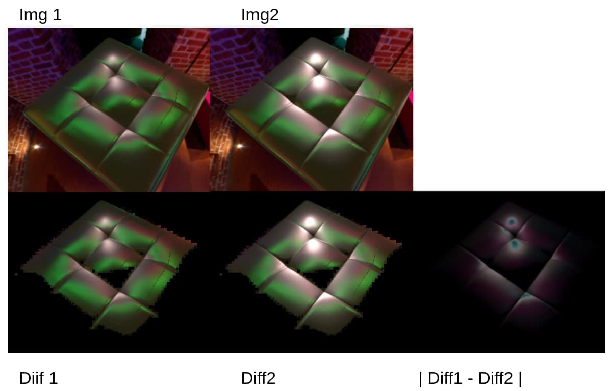
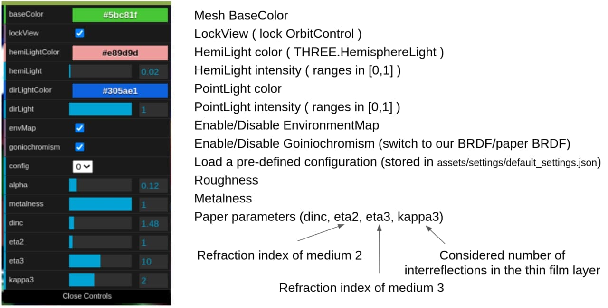
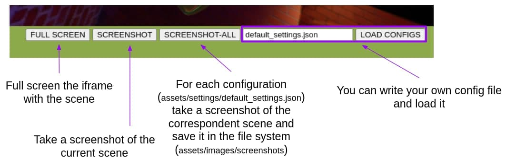

# BRDF Goniochromism (Iridescence)


--- 
## Get Started

Download the required `node_modules` for front-end and back-end

```{sh}
git clone https://github.com/EdoardoLenzi9/BRDF_Goniochromism.git
cd BRDF_Goniochromism
npm install
```

Start the web server (http://localhost:8080)

```{sh}
node index.js
# see http://localhost:8080
```

Download the required dependencies for Python3

```{sh}
python3 -m pip install -r requirements.txt
```

Run the python script

```{sh}
python3 image_processing.py -h
```

You shoud see something like this:

```
usage: image_processing.py [-h] [--diff N N]

                              Welcome to Image Processing Script :)  

                  ___           ___                    ___         ___           ___           ___     
    ___          /__/\         /  /\                  /  /\       /  /\         /  /\         /  /\    
   /  /\        |  |::\       /  /:/_                /  /::\     /  /::\       /  /::\       /  /:/    
  /  /:/        |  |:|:\     /  /:/ /\              /  /:/\:\   /  /:/\:\     /  /:/\:\     /  /:/     
 /__/::\      __|__|:|\:\   /  /:/_/::\            /  /:/~/:/  /  /:/~/:/    /  /:/  \:\   /  /:/  ___ 
 \__\/\:\__  /__/::::| \:\ /__/:/__\/\:\          /__/:/ /:/  /__/:/ /:/___ /__/:/ \__\:\ /__/:/  /  /\
    \  \:\/\ \  \:\~~\__\/ \  \:\ /~~/:/          \  \:\/:/   \  \:\/:::::/ \  \:\ /  /:/ \  \:\ /  /:/
     \__\::/  \  \:\        \  \:\  /:/            \  \::/     \  \::/~~~~   \  \:\  /:/   \  \:\  /:/ 
     /__/:/    \  \:\        \  \:\/:/              \  \:\      \  \:\        \  \:\/:/     \  \:\/:/  
     \__\/      \  \:\        \  \::/                \  \:\      \  \:\        \  \::/       \  \::/   
                 \__\/         \__\/                  \__\/       \__\/         \__\/         \__\/    

optional arguments:
  -h, --help  show this help message and exit
  --diff N N  Compares 2 images

Source: https://github.com/EdoardoLenzi9/BRDF_Goniochromism
```

Compare two images

```
python3 image_processing.py --diff assets/images/test0.jpg assets/images/test1.jpg
```

this should generate 3 images:
1. `/assets/images/diff_test0.py`
2. `/assets/images/diff_test1.py`
3. `/assets/images/diff.py`




## UI Tour




---
## Disclamer 

* The material contained in these project is restricted to students/professors of the 3D Interactive course of the Master of Computer Science at the University of Udine.

* It prohibited any use other than that inherent to the course, and in particular is expressly prohibited its use for any commercial purposes and/or for profit.

<br/><br/>

---
## Credits

* See also [A Practical Extension to Microfacet Theory for the Modeling of Varying Iridescence](https://blogs.unity3d.com/2017/05/09/a-practical-extension-to-microfacet-theory-for-the-modeling-of-varying-iridescence/)
* [Chair](https://www.turbosquid.com/3d-models/3d-banquette---v-ray-model-1530280)


---
> License: WTFPL-2.0
---